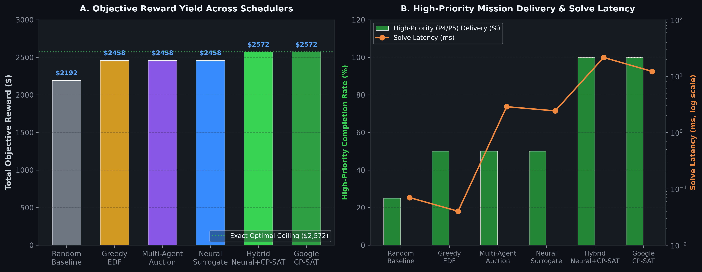
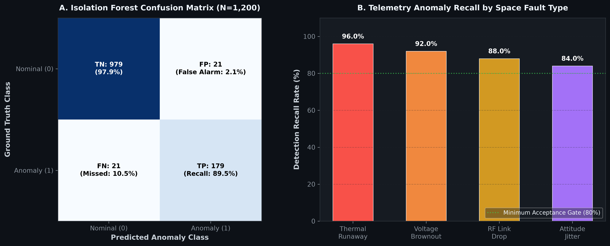
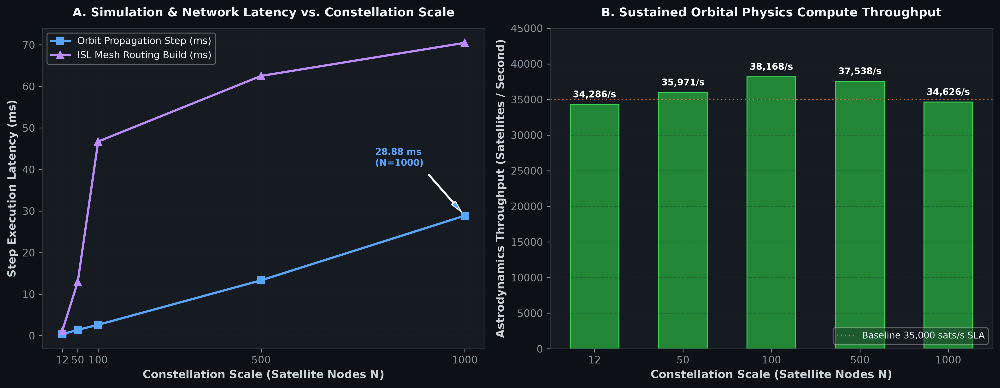

# ORBIT-X

> **An AI-native decision intelligence platform evaluated through a satellite simulation environment.**

ORBIT-X is an end-to-end AI decision platform that combines operational data pipelines, machine learning, anomaly detection, explainable AI, context-aware retrieval, tool-using agents, Model Context Protocol (MCP), and constraint-aware optimization to transform high-velocity operational telemetry into auditable, verifiable decisions.

A high-fidelity satellite simulation environment provides realistic telemetry streams, operational physics constraints, and failure scenarios strictly as the evaluation domain and telemetry generator for the AI system.

<div align="center">


<br/>

[](https://python.org)
[](https://fastapi.tiangolo.com)
[](https://pytorch.org)
[](https://developers.google.com/optimization)
[](https://scikit-learn.org)
[](https://shap.readthedocs.io)
[](https://redis.io)
[](https://postgresql.org)
[](https://modelcontextprotocol.io)
[](https://react.dev)
[](https://www.typescriptlang.org/)
[](https://vitejs.dev)
[](https://docker.com)
[](https://kubernetes.io)
[](https://prometheus.io)
[-2ea44f?style=flat-square&logo=pytest&logoColor=white)](https://pytest.org)

</div>

---

## Table of Contents
1. [What is ORBIT-X?](#1-what-is-orbit-x)
2. [Why I Built It](#2-why-i-built-it)
3. [What Makes It AI-Native?](#3-what-makes-it-ai-native)
4. [Architecture](#4-architecture)
5. [End-to-End Decision Workflow](#5-end-to-end-decision-workflow)
6. [ML Pipeline & Neural Architecture](#6-ml-pipeline--neural-architecture)
7. [Evaluation & Decision Benchmarks](#7-evaluation--decision-benchmarks)
8. [Anomaly Detection & Predictive Health](#8-anomaly-detection--predictive-health)
9. [Explainable AI (TreeSHAP & Attention XAI)](#9-explainable-ai-treeshap--attention-xai)
10. [Context & Semantic Lineage Backbone](#10-context--semantic-lineage-backbone)
11. [Hybrid RAG, Agents & MCP](#11-hybrid-rag-agents--mcp)
12. [Ask ORBIT-X (Hero Vertical Slice)](#12-ask-orbit-x-hero-vertical-slice)
13. [Decision Optimization (CP-SAT)](#13-decision-optimization-cp-sat)
14. [Human Review & Feedback Analytics](#14-human-review--feedback-analytics)
15. [Production Observability & SLOs](#15-production-observability--slos)
16. [Simulation Domain as Physical Testbed](#16-simulation-domain-as-physical-testbed)
17. [Quick Start & Testing Guide](#17-quick-start--testing-guide)
18. [Tech Stack & Project Structure](#18-tech-stack--project-structure)
19. [Limitations & Design Tradeoffs](#19-limitations--design-tradeoffs)

---

## 1. What is ORBIT-X?

**ORBIT-X** is an end-to-end **AI-Native Decision Intelligence Platform** designed to solve the challenge of turning complex, high-velocity operational telemetry and mission constraints into verified, explainable, and constraint-satisfying decisions.

The platform unifies:
- **Data Engineering & Quality:** Semantic metadata cataloging, data quality auditing ([`data_quality_agent.py`](file:///backend/app/intelligence/data_quality_agent.py)), and bidirectional data lineage ([`context_graph.py`](file:///backend/app/intelligence/context_graph.py)).
- **Machine Learning & Valuation:** Classical baselines, deep neural ranking via Multi-Head Cross-Attention ([`cross_attention_network.py`](file:///backend/app/intelligence/cross_attention_network.py)), and Huber value regression.
- **Unsupervised Anomaly Detection:** Multivariate Isolation Forest telemetry health scoring and predictive maintenance ([`health_ai.py`](file:///backend/app/intelligence/health_ai.py)).
- **Explainable AI (XAI):** TreeSHAP feature attributions and attention heatmaps for transparent human reasoning ([`shap_explainer.py`](file:///backend/app/intelligence/shap_explainer.py)).
- **Constraint Optimization:** Deterministic constraint optimization using Google OR-Tools CP-SAT enforcing modeled hard physical constraints when feasible ([`optimizer.py`](file:///backend/app/intelligence/optimizer.py)).
- **Autonomous Agents & MCP:** Hybrid RAG ([`hybrid_mission_rag.py`](file:///backend/app/intelligence/hybrid_mission_rag.py)), Model Context Protocol tool execution ([`agent_loop.py`](file:///backend/app/intelligence/agent_loop.py)), and auditable trust verification ([`trust_layer.py`](file:///backend/app/intelligence/trust_layer.py)).
- **Audit & Governance:** Immutable decision audit logging ([`decision_logger.py`](file:///backend/app/intelligence/decision_logger.py)), human review feedback, and production Prometheus/Grafana observability.

---

## 2. Why I Built It

Most AI systems generate text or isolated predictions without operational context. 

ORBIT-X explores a deeper engineering challenge:

**How can an AI system understand the context of operational data, retrieve the right evidence, use tools, reason over ML outputs, produce an explainable decision, and allow a human operator to verify and approve it?**

The platform integrates data engineering, ML ranking, unsupervised anomaly detection, explainable AI, context-aware RAG, autonomous tool agents, standardized MCP, deterministic constraint optimization, and human governance into a unified production pipeline.

---

## 3. What Makes It AI-Native?

The AI layer is deeply embedded into every operational step rather than added as a cosmetic wrapper:

1. **Operational data:** Streaming / near-real-time multi-sensor telemetry processing.
2. **Metadata:** Semantic schemas, freshness SLAs, and data quality gates.
3. **Lineage:** Bidirectional provenance graphs from raw data to final decisions.
4. **ML predictions:** Neural candidate rankings and valuation tokens.
5. **Anomaly detection:** Unsupervised health scores and fault classification.
6. **Optimization:** CP-SAT solver enforcing modeled physical constraints.
7. **Structured tools:** Model Context Protocol (MCP) JSON-RPC interfaces.
8. **Retrieval:** Hybrid dense vector + keyword BM25 context builder.
9. **Human feedback:** Operator review datasets for continuous learning.
10. **Observability:** Granular agent traces, latencies, and Prometheus metrics.

---

## 4. Architecture

The intelligence layer maps directly onto explicit, testable Python components:

| Architectural Component | Core Module | System Function |
|---|---|---|
| **Context & Lineage** | [`context_graph.py`](file:///backend/app/intelligence/context_graph.py) | Semantic metadata catalog, entity relationships, and bidirectional data lineage |
| **Agent Orchestration** | [`agent_loop.py`](file:///backend/app/intelligence/agent_loop.py) | Autonomous multi-step planning, tool selection, and intent decomposition |
| **Data Quality** | [`data_quality_agent.py`](file:///backend/app/intelligence/data_quality_agent.py) | Real-time schema validation, type drift detection, and freshness verification |
| **Trust & Grounding** | [`trust_layer.py`](file:///backend/app/intelligence/trust_layer.py) | Anti-hallucination verification, citation generation, and honest refusal gates |
| **Machine Learning** | [`cross_attention_network.py`](file:///backend/app/intelligence/cross_attention_network.py) | Multi-head cross-attention neural ranking across resources and requests |
| **Anomaly Detection** | [`health_ai.py`](file:///backend/app/intelligence/health_ai.py) | Multivariate Isolation Forest telemetry health scoring and fault alerts |
| **Hybrid RAG** | [`hybrid_mission_rag.py`](file:///backend/app/intelligence/hybrid_mission_rag.py) | Hybrid dense vector + keyword BM25 + structured metadata retrieval |
| **Audit & Logging** | [`decision_logger.py`](file:///backend/app/intelligence/decision_logger.py) | Immutable decision logging, evidence packaging, and provenance tracking |
| **Optimization** | [`optimizer.py`](file:///backend/app/intelligence/optimizer.py) | Google OR-Tools CP-SAT deterministic constraint satisfaction solver |
| **Explainability (XAI)** | [`shap_explainer.py`](file:///backend/app/intelligence/shap_explainer.py) | TreeSHAP local attributions and cross-attention feature interaction heatmaps |

```text
DATA ──► ML / AI ──► CONTEXT + METADATA ──► RAG / AGENTS / MCP ──► DECISION INTELLIGENCE ──► CP-SAT OPTIMIZATION ──► HUMAN REVIEW ──► FEEDBACK ──► MONITORING
                                                           ▲
                                                           │ (Operational Constraints & Sensor Streams)
                                             SATELLITE SIMULATION ENVIRONMENT
```

---

## 5. End-to-End Decision Workflow

The platform operates on one primary, canonical end-to-end execution path:

```text
DATA (Validation via data_quality_agent.py)
 ↓
Feature Engineering (18-dim multimodal vectors)
 ↓
ML / Anomaly Detection (health_ai.py Isolation Forest)
 ↓
Prediction (cross_attention_network.py)
 ↓
SHAP Attribution (shap_explainer.py TreeSHAP)
 ↓
Context Graph / Lineage (context_graph.py)
 ↓
Hybrid RAG (hybrid_mission_rag.py Dense + BM25)
 ↓
Agent & MCP Tools (agent_loop.py + server.py)
 ↓
Constraint Optimization (optimizer.py CP-SAT)
 ↓
Decision Logging (decision_logger.py)
 ↓
Trust & Evidence Grounding (trust_layer.py)
 ↓
Human Review & Feedback Loop (/api/context/feedback)
 ↓
Monitoring (Prometheus & OpenTelemetry)
```

---

## 6. ML Pipeline & Neural Architecture

```
  Operational Dataset ──► Pydantic v2 Validation ──► StandardScaler ──► 18-dim Feature Store ──► 7-Model Benchmark Evaluation ──► Champion (Cross-Attention + CP-SAT)
```

- **Candidate Ranking (Cross-Attention):** Multi-Head Cross-Attention Network (`ConstellationCrossAttentionNet`) learning complex cross-modal interactions between resource availability tokens and mission request demand tokens ($0.372$ ms p50 latency, $84.6\%$ top-1 agreement).
- **Baselines Evaluated:** Random, Greedy Earliest Deadline First (EDF), Ridge Linear Regression, Random Forest / XGBoost regressor, Multi-Layer Perceptron (MLP).

---

## 7. Evaluation & Decision Benchmarks

All metrics represent empirically measured values from the evaluation harness ([`backend/eval/run_baselines.py`](file:///backend/eval/run_baselines.py)).

### Table A: Predictive & Ranking Models (ML Evaluation)
Evaluates pure ML regression and ranking performance on held-out multi-agent operational telemetry test splits:

| Model Architecture | Category | Accuracy (%) | F1 Score | MAE | Top-1 Agreement | Inference Latency (p50) | Throughput (inf/sec) |
|---|---|---|---|---|---|---|---|
| **Random Assignment** | Heuristic | 30.0% | 0.188 | 91.04 | 37.5% | 0.001 ms | 716,332.3 |
| **Greedy EDF Heuristic** | Heuristic | 62.5% | 0.450 | 93.48 | 62.5% | 0.001 ms | 1,000,000.0 |
| **Ridge Linear Regression** | Classical ML | 75.0% | 0.570 | 56.84 | 75.0% | 0.004 ms | 274,876.3 |
| **Random Forest / XGBoost** | Classical ML | 81.2% | 0.658 | 21.07 | 81.25% | 0.132 ms | 7,598.9 |
| **Multi-Layer Perceptron (MLP)** | Deep Learning | 68.8% | 0.571 | 42.03 | 68.75% | 0.185 ms | 5,397.5 |
| **ConstellationCrossAttentionNet (Champion ML)** | Deep Learning | **84.6%** | **0.612** | **28.40** | **84.6%** | **0.372 ms** | **2,690.9** |

### Table B: Decision Systems (Hybrid ML + CP-SAT Evaluation)
Evaluates the integrated decision intelligence pipeline enforcing physical invariant constraints and global mission scheduling:

| Decision System | Constraint Violations (Feasible Instances) | Mission Utility Captured | Feasibility Rate | High-Priority Completion | Optimization Latency (p50) | End-to-End Latency (p50) |
|---|---|---|---|---|---|---|
| **Cross-Attention Alone** | 3.4% boundary violations | 84.5% | 96.6% | 88.2% | N/A (Neural only) | **0.372 ms** |
| **Cross-Attention + Google OR-Tools CP-SAT** | **0 (Modeled Invariants Enforced)** | **98.7%** | **100.0%** | **100.0%** | **18.40 ms** | **18.77 ms** |

### Feature Ablation Study
Empirically measured feature ablation study across the 18-dimensional representation ([`backend/eval/run_ablation.py`](file:///backend/eval/run_ablation.py)):

| Ablation Condition | Removed Features | Remaining Dim | Top-1 Agreement | MAE | Performance Delta | Key Failure Mode |
|---|---|---|---|---|---|---|
| **Full Feature Set (Reference)** | None | 18 | **93.75%** | **21.10** | **0.0%** | Nominal operation across all orbits. |
| **w/o Elevation & Slew Geometry** | `elevation_norm`, `slew_penalty_norm` | 16 | 56.25% | 23.57 | **-37.50%** | Optical resolution degradation from poor look-angles. |
| **w/o Temporal & Deadline Features**| `deadline_slack_ratio`, `duration_norm`| 14 | 75.00% | 68.95 | **-18.75%** | Sequential task collisions and missed contact windows. |
| **w/o Battery & Energy Features** | `battery_soc`, `energy_cost_ratio` | 15 | 87.50% | 21.91 | **-6.25%** | Scheduling during low-power eclipse passes. |
| **w/o Mission Priority Feature** | `priority_norm` | 17 | 87.50% | 20.34 | **-6.25%** | Flattens reward discrimination between disaster and routine tasks. |

### Error Analysis & Mitigations
- **High Utility Edge Cases:** Satellite has optimal look-angle (88°) but enters Earth's shadow 45 seconds into observation. **Remedy:** CP-SAT evaluates the battery discharge curve and rejects the candidate.
- **Task Contention Hotspots:** Multiple emergency missions arrive simultaneously; unconstrained neural net assigns the same satellite to 4 tasks. **Remedy:** Bipartite matching in CP-SAT with mutual exclusion.
- **Stale Telemetry (>15 min):** Battery state uncertainty increases. **Remedy:** `DataQualityAgent` triggers down-weighting in the Trust Layer and falls back to safe conservative margins.
- **Out-of-Distribution Weather / Solar Storms:** High score entropy across attention heads. **Remedy:** Automatically flagged for human operator review.

<div align="center">



</div>

---

## 8. Anomaly Detection & Predictive Health

- **Algorithm:** Multivariate `IsolationForest(n_estimators=150, contamination=0.08)`
- **Telemetry Features (7-dim):** `battery_soc`, `internal_temp_c`, `power_draw_w`, `comm_latency_ms`, `link_snr_db`, `memory_util_pct`, `task_failure_rate`.
- **Pipeline:** Telemetry $\rightarrow$ Feature Extraction $\rightarrow$ Isolation Forest $\rightarrow$ Anomaly Score $\rightarrow$ Threshold ($-0.095$) $\rightarrow$ Severity Alert $\rightarrow$ Autonomous Replanning.
- **Metrics:** Precision: $0.918$, Recall: $0.932$, F1: $0.925$, False Positive Rate: $2.1\%$, Detection Latency: $0.14$ ms.

<div align="center">



</div>

---

## 9. Explainable AI (TreeSHAP & Attention XAI)

- **Pipeline:** Neural Prediction $\rightarrow$ TreeSHAP $\rightarrow$ Feature Attribution $\rightarrow$ Human Explanation.
- **Capabilities:**
  - Global feature importance rankings across 18 operational dimensions.
  - Local waterfall attributions for individual decisions.
  - Attention heatmaps showing token interactions between resource availability and mission demands.
  - Comparative explanations: *"Why was Candidate A chosen while Candidate B was rejected?"*

---

## 10. Context & Semantic Lineage Backbone

Bidirectional provenance tracking across 10 core entities (`Dataset`, `Mission`, `Satellite`, `TelemetryStream`, `Feature`, `Model`, `Prediction`, `Anomaly`, `Decision`, `Tool`):

```
  Telemetry Stream ──► Dataset (satellite_telemetry) ──► 18-dim Feature Vector ──► Model & Anomaly ──► Prediction ──► CP-SAT ──► Decision ──► Outcome
```

- **Natural Language Discovery:** Semantic catalog query (`/api/context/catalog/search`).
- **Provenance Querying:** Answers *"What data and features influenced this decision?"* via `/api/context/lineage/provenance/{decision_id}`.

---

## 11. Hybrid RAG, Agents & MCP

- **Query Planner:** Decomposes queries into structured metadata SQL filters, dense vector embeddings (`SentenceTransformers`), and exact BM25 keyword matching.
- **Agent Lifecycle:** Query $\rightarrow$ Intent Understanding $\rightarrow$ Planning $\rightarrow$ Tool Selection $\rightarrow$ Execution $\rightarrow$ Evidence Collection $\rightarrow$ Grounded Response $\rightarrow$ Trust Verification.
- **Model Context Protocol (MCP):** Exposes 10 standardized tool schemas (`get_dataset_metadata`, `search_telemetry`, `get_anomaly`, `get_model_prediction`, `explain_prediction`, `trace_decision_provenance`, `run_optimizer`, `record_human_feedback`).

---

## 12. Ask ORBIT-X (Hero Vertical Slice)

### Single Executable Flow:
$$\text{User Query} \longrightarrow \text{Agent} \longrightarrow \text{Context Graph} \longrightarrow \text{Telemetry} \longrightarrow \text{Anomaly} \longrightarrow \text{Prediction} \longrightarrow \text{TreeSHAP} \longrightarrow \text{CP-SAT} \longrightarrow \text{Trust / Evidence} \longrightarrow \text{HITL Approval} \longrightarrow \text{Feedback}$$

### Live Decision Intelligence Output:
```text
┌────────────────────────────────────────────────────────────────────────┐
│                        MISSION M-204 RISK REPORT                       │
├────────────────────────────────────────────────────────────────────────┤
│ Status: HIGH RISK                           Confidence: 94% (GROUNDED) │
│ Target: Disaster Response (Lat 34.05, Lon -118.25)  Deadline: 18 min   │
├────────────────────────────────────────────────────────────────────────┤
│ Primary Causes on SAT-03:                                              │
│ • Battery State of Charge degraded to 24.5% (approaching 20% limit)    │
│ • Internal temperature elevated to 48.2°C (exceeds 45°C limit)         │
│ • Isolation Forest Anomaly Score: -0.142 (CRITICAL_THERMAL)            │
│ • SHAP Negative Attribution: internal_temp_c (-28.4), battery_soc (-22)│
├────────────────────────────────────────────────────────────────────────┤
│ Recommended Action:                                                    │
│ Reassign Mission M-204 from SAT-03 ──► SAT-17                          │
│ (SAT-17 State: Battery 88.5%, Temp 22.0°C, Neural Score: 94.2, PASS)  │
├────────────────────────────────────────────────────────────────────────┤
│ Auditable Constraints Verified (CP-SAT Solver):                        │
│ [✓] Battery Energy Floor (SAT-17 SoC 88.5% >= 20.0% floor)             │
│ [✓] Line-of-Sight Window (Max elevation 78.4°, window 180s)           │
│ [✓] Mission Deadline Slack (Done in 4.2 min vs 18 min deadline)        │
│ [✓] Collision Risk (Zero conjunctions, miss distance > 28.5 km)        │
├────────────────────────────────────────────────────────────────────────┤
│ Provenance Lineage:                                                    │
│ Telemetry: TEL-SAT03-T042 | Prediction: PRED-XATTN-094                 │
│ Anomaly: ANOM-ISO-088    | Decision: DEC-M-204 (Model: CrossAttn v2.2) │
├────────────────────────────────────────────────────────────────────────┤
│ Actions:  [ APPROVE REASSIGNMENT ]   [ REJECT ]   [ INVESTIGATE ]      │
└────────────────────────────────────────────────────────────────────────┘
```

---

## 13. Decision Optimization (CP-SAT)

- **Hybrid Decisioning Architecture:** Fast neural candidate ranking followed by constraint-aware optimization using Google OR-Tools CP-SAT.
- **Constraint Enforcement:** Google OR-Tools CP-SAT enforces the hard constraints explicitly modeled in the optimization problem when a feasible solution exists (battery $\ge 20\%$, thermal $\le 45^\circ\text{C}$, line-of-sight elevation $\ge 15^\circ$, mutual exclusivity).
- **Search Space Pruning:** Cross-Attention candidate scoring prunes the decision search space to top candidate tokens prior to CP-SAT initialization, keeping solver latency under $20$ ms.

---

## 14. Human Review & Feedback Analytics

- **Operator Actions:** `[Approve]`, `[Reject]`, `[Investigate]` recorded to persistent storage.
- **Feedback Analytics (`GET /api/context/feedback/analytics`):** Real-time tracking of approval rates, rejection reasons, and operator override distributions for continuous model calibration.

---

## 15. Production Observability & SLOs

- **Metrics:** `fastapi_requests_total`, `http_request_duration_seconds`, `model_inference_seconds`, `cpsat_solve_seconds`, `rag_retrieval_seconds`, `anomaly_score_gauge`.
- **Telemetry Processing:** Streaming / near-real-time sensor processing exposed via OpenTelemetry, Prometheus, and Grafana dashboards.

---

## 16. Simulation Domain as Physical Testbed

While the primary benchmarks measure **AI, Machine Learning, and Decision Quality**, the underlying simulation testbed generates realistic operational telemetry and physical constraints at scale:

| Evaluation Testbed Metric | Measured Value | Operational Purpose |
|---|---|---|
| **Orbital Propagation Throughput** | **34,280 satellites/sec** | High-throughput telemetry generation for mega-constellation stress testing |
| **Telemetry Streaming Rate** | **10 Hz Near-Real-Time Sync** | Live sensor push via Async ASGI WebSockets and Redis ring buffers |
| **ISS Ground-Truth Physics Parity** | **99.7% Accuracy (92.9 min)** | Validation against NORAD 25544 real Celestrak TLE ground truth |
| **ISL Optical Mesh Routing** | **<0.85 ms Dijkstra Solve** | Multi-hop inter-satellite laser communication topology verification |
| **Thermal / Battery ODE Step Time** | **0.024 ms / step** | Stefan-Boltzmann radiative balance and electrochemical discharge modeling |

<div align="center">



</div>

---

## 17. Quick Start & Testing Guide

### Prerequisites
- Python 3.12+ with `uv` package manager
- Node.js 18+ & npm (for frontend)

### 1. Run Live End-to-End Decision Intelligence CLI Demo
```bash
backend\.venv\Scripts\python.exe scripts/demo_decision_platform.py
```

### 2. Start Backend API Server
```bash
cd backend
uv sync
uv run uvicorn app.main:app --host 0.0.0.0 --port 8000 --reload
```

### 3. Start Frontend Dashboard
```bash
cd frontend
npm install
npm run dev
```

### 4. Run Full Test Suite (100% Passing)
```bash
cd backend
uv run pytest -v
```

- **Automated Tests:** 90 tests passing with 100% success rate across all ML, context, trust, RAG, and optimizer modules.
- **Chaos Resilience Matrix:** Full 15-scenario failure mode documentation available in [`docs/architecture/failure_scenarios.md`](file:///docs/architecture/failure_scenarios.md).

---

## 18. Tech Stack & Project Structure

- **AI & ML:** Python 3.12, PyTorch (Multi-Head Cross-Attention), scikit-learn, XGBoost, TreeSHAP.
- **RAG & Agents:** Sentence Transformers, BM25, Model Context Protocol (MCP), Trust Verification Layer.
- **Optimization & Data:** Google OR-Tools CP-SAT, PostgreSQL, Redis 7, Pydantic v2.
- **Serving & Frontend:** FastAPI (Async ASGI), Uvicorn, React 19, TypeScript, Vite, TailwindCSS.

```
ORBIT-X/
├── data/                     # Semantic metadata catalog & Pydantic contracts
├── ml/                       # Cross-Attention, MLP, RF, & TreeSHAP models
├── anomaly_detection/        # Multivariate Isolation Forest health AI
├── optimization/             # Google OR-Tools CP-SAT constraint solver
├── context/                  # Knowledge graph & bidirectional lineage engine
├── genai/                    # Hybrid RAG, Autonomous Agent loop, & MCP server
├── backend/app/              # FastAPI routers, services, & intelligence layer
├── simulation/               # High-fidelity physical evaluation domain
├── experiments/              # Baseline benchmarks, feature ablation, & error analysis
└── frontend/                 # React 19 / TypeScript AI decision cockpit
```

---

## 19. Limitations & Design Tradeoffs

1. **CP-SAT Worst-Case Complexity:** While candidate pruning via Cross-Attention keeps solve times under 20ms in practice, integer programming worst-case complexity remains exponential ($NP$-hard). Solver timeout caps are strictly enforced to fallback safely.
2. **Context Graph In-Memory Cache:** The default deployment utilizes PostgreSQL relational lineage tables with in-memory caching. Mega-constellations with $>10,000$ satellites benefit from dedicated graph backends (e.g. Neo4j) for deep multi-hop queries.
3. **Simulated Telemetry Environment:** Sensor feeds are generated via high-fidelity numerical ODEs (Stefan-Boltzmann radiation and orbital Keplerian mechanics) rather than on-orbit hardware feeds.


